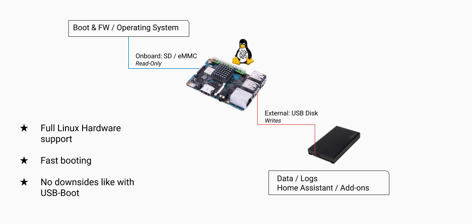

# Partition

The partition layout is a bit different than the typical setup. We prefer GPT, if possible. With SoCs which don't support GPT, we use a hybrid GPT. For more details about this topic, please refer to the [development](development.md) documentation.

The system is designed to have as few write operations to the storage media as possible. This means that we only write during the OTA updates and 5-6 times per week on the overlay partition. The data partition receives the main I/O operations and for this reason is ideal for placing on a different drive.

A visual representation looks like this:

```text
-------------------------
|       Bootloader      |
-------------------------
|       Kernel A        |
-------------------------
|       System A        |
|                       |
-------------------------
|       Kernel B        |
-------------------------
|       System B        |
|                       |
-------------------------
|       Bootstate       |
-------------------------
|       Overlay         |
|                       |
...

-------------------------
|       Data            |
|                       |
-------------------------
```

Sometime the bootloader part can look different because there can be firmware or SPLs for boot the CPU on the SoC.

## Data disk



The data partition is the only partition with real I/O. It will be expanded automatically at boot to the full size of the disk.


## Using CLI to move the data partition.

In a Home Assistant OS installation, the data is stored on the `/mnt/data` partition of the boot storage (typically the SD card). This is the only read/write partition on the boot storage. Using the `datadisk` move command, this partition can be moved to an externally connected drive, leaving the rest of the read-only system on the boot storage.

The storage capacity of the external drive must be larger than the storage capacity of the existing disk.

```sh
$ ha os datadisk move /dev/sdx
```

This will make a reboot which going significantly longer than usual; please be patient!

For getting a list of supported detected devices which can be used by `datadisk`:

```sh
$ ha os datadisk list
```

## Using UI to move the data partition.

__follow__


## Check Power Supply Rating
Using an USB attached SSD can draw quite some power. For instance on Raspberry Pi 3 the official Raspberry Pi power supply (PSU) only provides 2.5A which can be too tight. Use a power supply which can at least provide 3.5A. Alternatively use a powered USB hub. Connect the Hub to one of the USB slots of your Raspberry Pi, and connect the SSD to the Hub. The power supply that came with the Hub will power the attached device(s).
